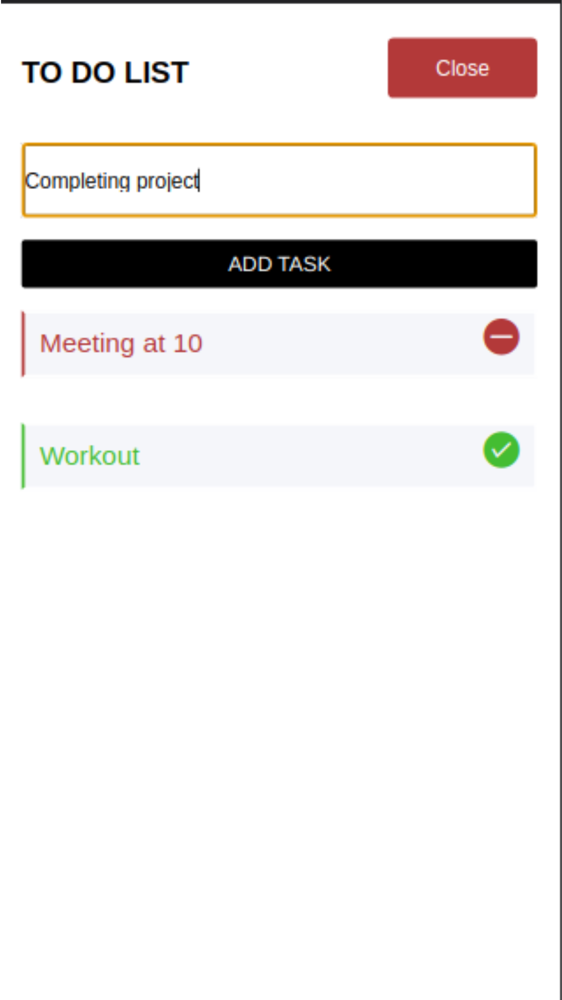
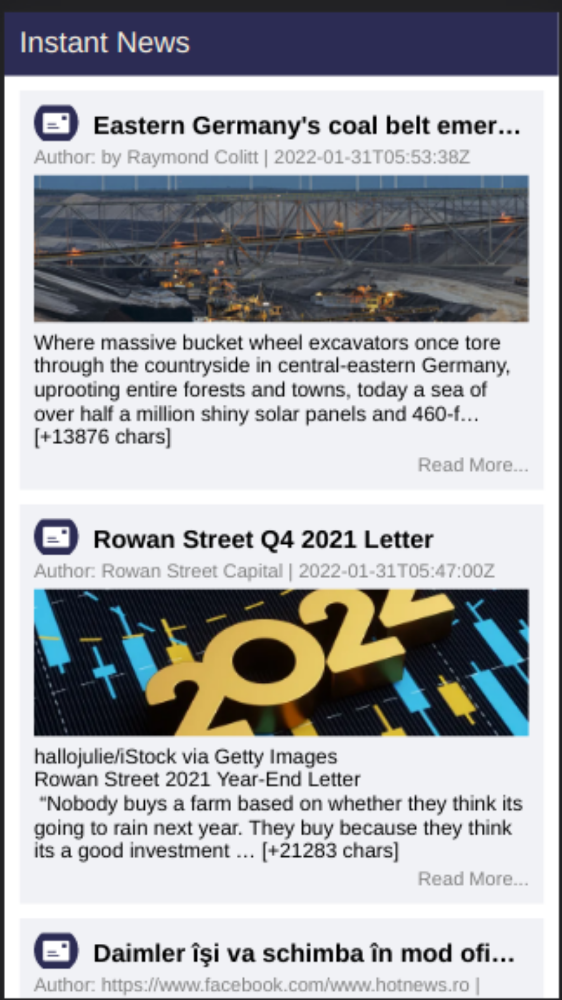
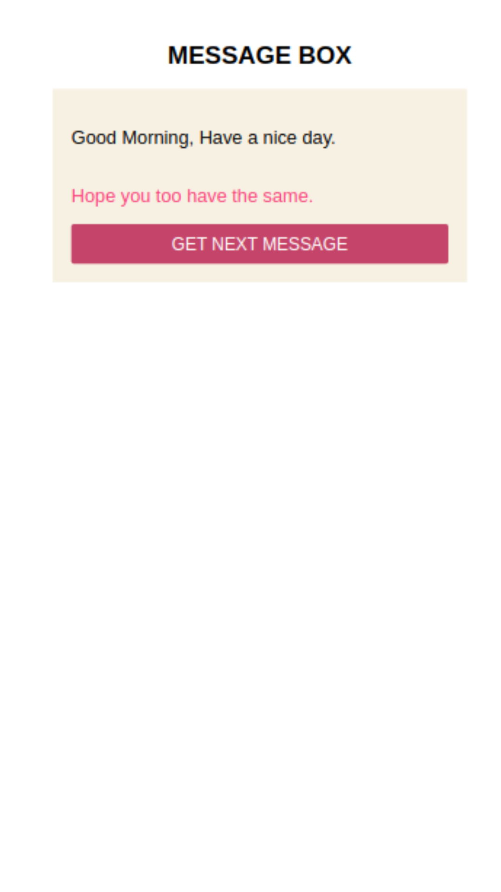
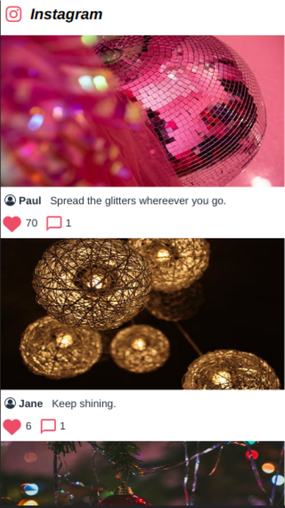

# React Native Basic Projects

|                              To-Do App                       |                             News App                             |                           Message Box                          |                             Instagram                              |
| :-------------------------------------------------------------: | :-----------------------------------------------------------------: | :------------------------------------------------------------: | :--------------------------------------------------------------: |
|  |  |  |  |

## Environment setup

- Expo-cli - https://docs.expo.dev/
- Node js - https://nodejs.org/en/ 

## Installation

Install the dependencies and devDependencies and start the server.

```sh
cd choose_a_folder
npm install
expo start
```

##### For news-app..
ADD A CONFIG FILE config.js WITH AN API_KEY

```sh
API_KEY=SAMPLE_KEY12293903
```

<!-- ## Screenshots -->

<!-- ### To Do App


 -->
